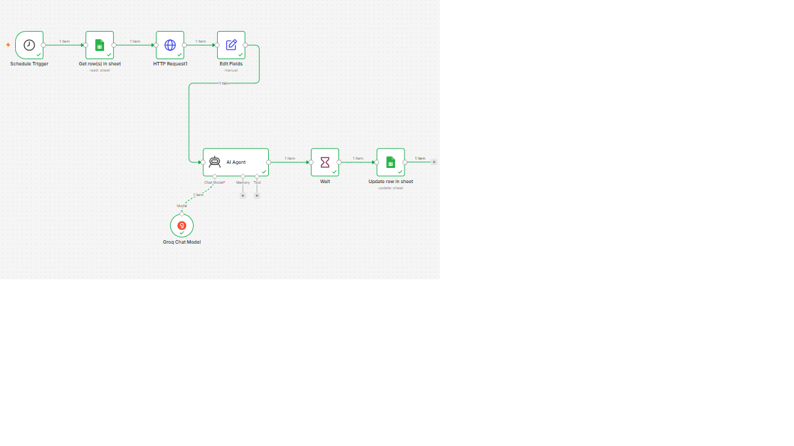

# AI Agent Content Creator

This project is an AI content creator workflow built with n8n.

It reads YouTube URLs from Google Sheets, extracts the transcript, sends it to Groq AI, generates Instagram captions, hashtags, and summaries, then updates the Google Sheet and marks the task as Completed.

## Tools Used

- n8n
- Google Sheets
- Supadata API
- Groq AI
- HTTP Request node

## Instagram Auto Posting

This project has been extended to support Instagram auto-posting using the Meta Instagram Graph API.

The workflow can:

- Generate Instagram captions using AI
- Use a public image URL for the Instagram post
- Create Instagram media through the Meta Graph API
- Publish the media to Instagram
- Update the posting status in Google Sheets

Workflow:

Google Sheets → Transcript Extraction → AI Content Generation → Wait Until Scheduled Time → Create Instagram Media → Publish Instagram Post → Update Status = Posted

## Future Enhancements

Future versions of this project will improve the workflow by:

- Separating captions, hashtags, and summaries into different Google Sheet columns
- Adding an approval step before posting
- Generating AI images automatically
- Improving error handling for expired access tokens
- Supporting multiple social media platforms

## Workflow Screenshot

## Features

- Reads YouTube URLs from Google Sheets
- Extracts video transcripts using Supadata API
- Generates Instagram captions using Groq AI
- Creates hashtags and content summaries
- Updates Google Sheets automatically
- Supports future Instagram auto-posting integration

## Project Status

Current Status: In Development

Completed:
- Google Sheets integration
- Transcript extraction
- AI caption generation
- Workflow automation in n8n

In Progress:
- Instagram Graph API integration
- Automated post publishing

